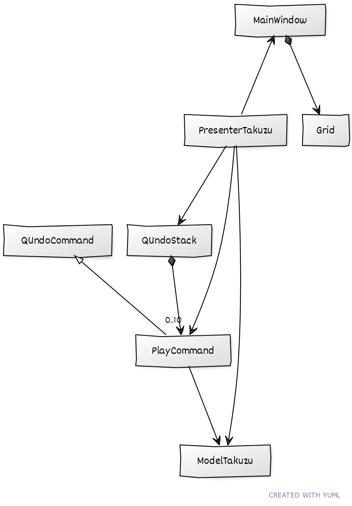
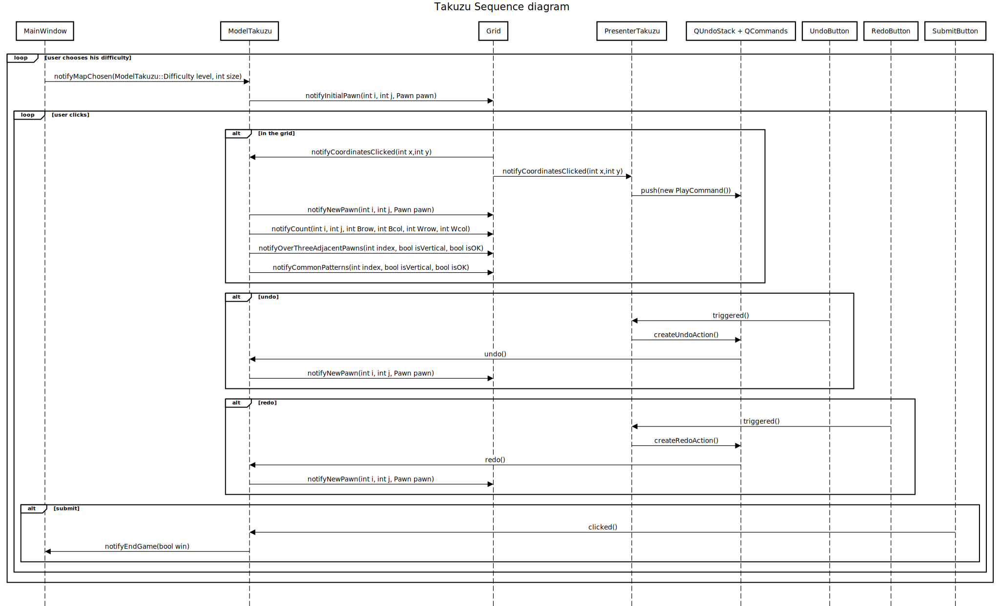

# Takuzu board game - Qt GUI project
_last edit: 10 April 2020_

----
__Authors__:
- *Quentin DERAMBURE <quentin.derambure@ecole.ensicaen.fr>*
- *Christian ZHENG <christian.zheng@ecole.ensicaen.fr>*

## Description

This project is part of the practical work [Graphic interface design](http://livretpedagogique.ensicaen.fr/pages/afficherMatiere.php?s=1&m=0&u=73&mo=178&ma=253&) taught by Mr. Fourey at [ENSICAEN](https://www.ensicaen.fr/)(France).

The objective is to recreate the game of [Takuzu](https://en.wikipedia.org/wiki/Takuzu).

## Implemented core features

- [x] Choice of size and level of difficulty
- [x] Indication of correct lines/columns
- [x] Stopwatch indicating game time
- [x] Highlighting of errors (more than three contiguous pawns of the same colour, identical rows/columns)
- [x] Numerical indication of the number of cells of each colour on each row/column
- [x] Counting the number of rewind made by the player
- [ ] Customizing the display of checkbox states (other than by disks)
- [ ] Different modes of assistance

## Choices made regarding ergonomics

Some useful keyboard shortcuts are implemented. A comprehensive list is accessible throught the interface.
The window is easily resizable, and the grid stays at the center.

## Modeling choices

For the architecture of our software, we have proceeded to a three-thirds division, Model-View-Presentation, coupled with a design-pattern Command(management of undo/redo).

Most of the communication between the classes of our software takes place with the system of Slots that pick up Signals, allowed by Qt.

## Division of labor within the pair

Christian: I worked on the model part of the project. I wrote most of the ModelTakuzu class, as well as the undo/redo management.

----
Quentin: I worked on the view part of the project. Thus, I wrote the Grid and MainWindow classes. I also wrote a very small part of the model code to pick a grid in particular and not a random grid.

----
Common: We worked together simultaneously on the development of the presenter, which contains all the connections between the signals of one and the slots of the other. Each also helped debugging the other's part.

## Notes
